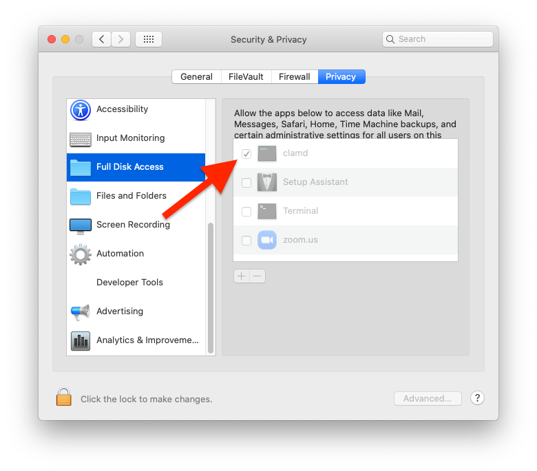

# clamav

### Master Branch
[](https://github.com/osx-provisioner/collection/actions/workflows/workflow-clamav-push.yml)

### Dev Branch
[](https://github.com/osx-provisioner/collection/actions/workflows/workflow-clamav-push.yml)

Ansible role that installs ClamAV antivirus on OSX machines.

### Notes
- See the [ClamAV GitHub Repository](https://github.com/Cisco-Talos/clamav) for further details about this tool.

### Catalina and Later

On OSX versions >= 10.15, there's a manual post installation step that should be done to maximize protection.  (This is required to monitor the `Downloads` folder.)

ClamAV should be granted `Full Disk Access`.  This requires making the appropriate selection inside `System Preferences --> Security`:



Requirements
------------

- [Homebrew](https://brew.sh/) must already be present on the machine ([geerlingguy.mac.homebrew](https://github.com/geerlingguy/ansible-collection-mac) is a great solution for this).

Role Variables
--------------

| Variable Name                      | Value                                                                                                    |
|------------------------------------|----------------------------------------------------------------------------------------------------------|
| brew_user                          | The user to run homebrew operations as.                                                                  |
| brew_prefix                        | Usually `/usr/local` or `/opt/homebrew` depending on your OSX version.                                   |
| clamav_clamd_config_file           | The ClamD configuration file installation location.                                                      |
| clamav_clamd_log_file              | The ClamD daemon log file.                                                                               |
| clamav_clamd_stderr_log_file       | The ClamD daemon error log file.                                                                         |
| clamav_clamwatch                   | A boolean that indicates whether the ClamWatch daemon should be installed.                               |
| clamav_clamwatch_target_folder     | The folder the ClamWatch daemon will monitor.                                                            |
| clamav_clamwatch_quarantine_folder | The folder the ClamWatch daemon will move infected files to.                                             |
| clamav_clamwatch_log_file          | The ClamWatch daemon log file path.                                                                      |
| clamav_clamwatch_stderr_log_file   | The ClamWatch daemon error log file path.                                                                |
| clamav_database_location           | The location of the virus definition database.                                                           |
| clamav_freshclam_config_file       | The FreshClam configuration file installation location.                                                  |
| clamav_freshclam_log_file          | The FreshClam daemon log file.                                                                           |
| clamav_freshclam_stderr_log_file   | The FreshClam daemon error log file.                                                                     |
| clamav_homebrew_retries            | Sets the number of attempts homebrew will make to install dependencies. (For flaky network connections.) |

[See The Default Values](defaults/main.yml)

Dependencies
------------

None

Example Playbook
----------------

```yaml
- hosts: all
  roles:
  - role: elliotweiser.osx-command-line-tools # Dependency of geerlingguy.mac.homebrew
  - role: geerlingguy.mac.homebrew
  - role: osx_provisioner.collection.clamav
    vars:
      brew_prefix: /usr/local
      clamav_clamd_config_file: /usr/local/etc/clamav/freshclam.conf
      clamav_clamd_log_file: /var/log/clamav.clamd.log
      clamav_clamd_stderr_log_file: /var/log/clamav.clamd.error.log
      clamav_clamwatch: true
      clamav_clamwatch_target_folder: "{{ lookup('env','HOME') }}/Downloads"
      clamav_clamwatch_quarantine_folder: "{{ lookup('env','HOME') }}/Quarantine"
      clamav_clamwatch_log_file: /var/log/clamav.clamwatch.log
      clamav_clamwatch_stderr_log_file: /var/log/clamav.clamwatch.error.log
      clamav_database_location: /usr/local/var/lib/clamav
      clamav_freshclam_config_file: /usr/local/etc/clamav/freshclam.conf
      clamav_freshclam_log_file: /var/log/clamav.freshclam.log
      clamav_freshclam_stderr_log_file: /var/log/clamav.freshclam.error.log
```

License
-------

MIT

(ClamAV itself is licensed as GPLv2)

Author Information
------------------

Niall Byrne <niall@niallbyrne.ca>
