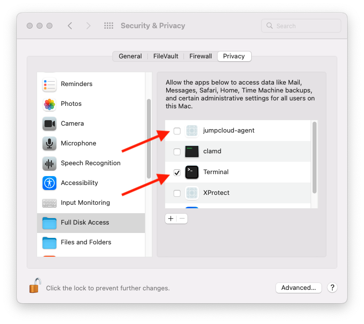

# jumpcloud

### Master Branch
[](https://github.com/osx-provisioner/collection/actions/workflows/workflow-jumpcloud-push.yml)

### Dev Branch
[](https://github.com/osx-provisioner/collection/actions/workflows/workflow-jumpcloud-push.yml)

Ansible role that installs the JumpCloud agent on OSX machines.

### Notes
- See the [JumpCloud Website](https://jumpcloud.com/) for further details about this platform.

### Monterey and Later

On OSX versions >= 12, there's are 2 manual installation steps required.
- **Prior** to installing this role, the **Terminal** application should be given `Full Disk Access`.  
- **While** installing this role, the `System Preferences` window will open, waiting five minutes for you to grant the JumpCloud Agent full disk access, before declaring the installation a failure.  

This requires making the appropriate selection inside `System Preferences --> Security`:



Once these steps are completed once, subsequent runs will complete without the interruption.

See the [JumpCloud Website](https://jumpcloud.com/) for further details about the agent's requirements.

Requirements
------------

None

Role Variables
--------------

| Variable Name                    | Value                                                                                                                                                                                                                               |
|----------------------------------|-------------------------------------------------------------------------------------------------------------------------------------------------------------------------------------------------------------------------------------|
| jumpcloud_agent_location         | The expected installation location.                                                                                                                                                                                                 |
| jumpcloud_agent_url              | The URL to the JumpCloud Agent installation script for OSX.  (Available from the JumpCloud website.)                                                                                                                                |
| jumpcloud_connect_key            | The preferred method of setting this variable is through the `JUMPCLOUD_CONNECT_KEY` environment variable. The value should be set to your JumpCloud Connect Key, this secret value is accessible from the JumpCloud admin console. |
| jumpcloud_installer_destination  | The ephemeral location for the downloaded installer script.                                                                                                                                                                         |
| jumpcloud_uninstall_url          | The URL to the JumpCloud Agent uninstall script for OSX.  (Available from the JumpCloud website, not currently used.)                                                                                                               |
| jumpcloud_upgrade                | A boolean which determines if the installer will try to update existing JumpCloud installs.                                                                                                                                         |

[See The Default Values](defaults/main.yml)

Dependencies
------------

None

Example Playbook
----------------

```yaml
- hosts: all
  roles:
  - role: osx_provisioner.collection.jumpcloud
    vars:
      jumpcloud_agent_location: /opt/jc
      jumpcloud_agent_url: "https://raw.githubusercontent.com/TheJumpCloud/support/master/scripts/macos/install_agent_and_serviceaccount.sh"
      jumpcloud_connect_key: "{{ lookup('env', 'JUMPCLOUD_CONNECT_KEY') }}"
      jumpcloud_installer_destination: /tmp/jc_installer.sh
      jumpcloud_uninstall_url: "https://github.com/TheJumpCloud/support/releases/download/mac_agent_uninstaller/remove_mac_agent.sh"
      jumpcloud_upgrade: false
```

License
-------

MIT

(JumpCloud licensing can be found [here](https://jumpcloud.com/legal))

Author Information
------------------

Niall Byrne <niall@niallbyrne.ca>
